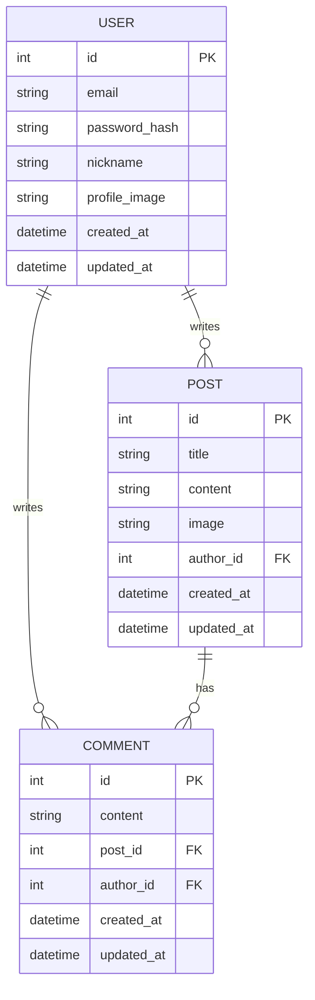

# 과즙상 커뮤니티 

FastAPI를 사용해 구현한 과일 닮은꼴 커뮤니티 사이트입니다.
개발은 초기 프로젝트 화면부터, 기능, 백엔드 연결까지 직접 구현했습니다.

## 개발 인원 및 기간
- 개발기간 : 2025-12-01 ~ 2025-12-02
- 개발 인원 : 프론트엔드/백엔드 1명 (본인)

## 사용기술 및 Tools
- SQLite
- FastAPI
  
## 프론트
- <a href="https://github.com/gyur2/ktb/tree/main/12WEEK/frontend">Frontend Github</a>
---

## 폴더 구조
<details>
  <summary>폴더 구조 보기/숨기기</summary>
  <div markdown="1">

    ├── auth.py
    ├── controllers.py
    ├── db.py
    ├── main.py
    ├── models.py
    ├── router.py
    ├── schemas.py
    ├── app.db
    ├── fruit_veg_resnet18.pt
    ├── model.py
    └── media/
         └── profile/

  </details>
  <br/>
  
## 구현기능 
#### Users & Auth
```
- 회원가입, 로그인, 내 정보 조회, 프로필 수정, 비밀번호 변경 기능 구현
- 비밀번호는 bcrypt 기반 해시로 저장하여 보안을 강화
- 로그인 성공 시 JWT 액세스 토큰 발급
- 토큰은 Authorization 헤더(`Bearer <token>`)로 전달
- FastAPI Dependency를 이용해 현재 로그인한 유저 정보를 엔드포인트에서 바로 사용
- 프로필 이미지는 서버의 media/profile/에 파일로 저장하고, 
  DB에는 해당 파일 경로(URL)를 저장하는 방식으로 구현

```

#### Posts
```
- 게시글 CRUD 기능 구현
    - 게시글 작성 (제목, 내용, 선택적 이미지)
    - 게시글 목록 조회 (필요 시 페이징/정렬 확장 가능)
    - 게시글 상세 조회
    - 게시글 수정/삭제 (작성자 본인만 수행 가능하도록 권한 체크)
- 인증된 유저만 게시글을 작성/수정/삭제할 수 있도록 보호
- 이미지가 없는 경우에는 image 필드를 null로 처리
```

#### Comments
```
- 댓글 CRUD 기능 구현
    - 특정 게시글에 댓글 작성
    - 댓글 수정/삭제 (작성자 본인만 허용)
- 댓글은 Post와 User를 참조하는 외래키 구조로 설계
- 인증이 필요한 엔드포인트로 구현하여 익명 댓글 방지

```
#### Image
```
- FastAPI의 UploadFile을 활용하여 이미지 업로드 처리
- media/profile/ 디렉토리에 실제 파일 저장
- DB에는 파일명 또는 상대 경로를 저장하여 클라이언트에서 바로 접근 가능
- 프론트엔드에서 FileReader를 사용해 업로드 전에 미리보기 제공

```
#### 과일, 채소 분류 API
```
- fruit_veg_resnet18.pt 모델 파일을 로드하여 추론하는 엔드포인트 구현
- 업로드된 이미지를 전처리 후 PyTorch 모델에 전달
- 예측된 클래스 및 확률을 JSON 형태로 반환
- FastAPI와 ML 모델을 연동해 간단한 MLOps 흐름을 경험

```
<br/>

## 📊 ERD (Mermaid)

<br/>

## 트러블 슈팅 
1. 이미지 업로드 시 개발 서버 무한 재로딩 현상
2. 로컬 파일 보안 정책(Fakepath) 및 이미지 엑박 문제
3. API 요청 헤더(Header) 및 데이터 포맷 충돌

## 프로젝트 후기
과제를 통해 배웠던, Router → Controller → Model 패턴을 FastAPI에도 적용해보면서 Pydantic을 활용한 요청/응답 검증, SQLAlchemy ORM을 이용한 DB 접근, JWT 기반 인증/인가 흐름
, 파일 업로드 및 정적 리소스 제공 방식 등을 한 번에 경험할 수 있는 좋은 연습이 되었습니다. 추후에는 더 실서비스에 가까운 백엔드를 만들어보고 싶습니다. 
